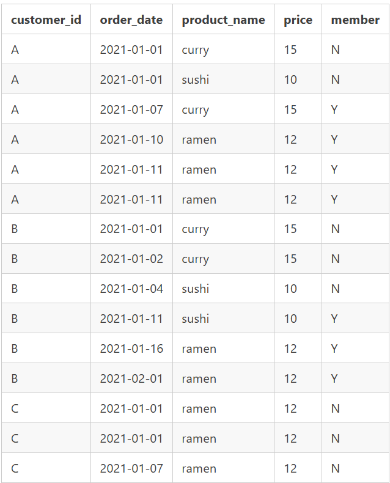
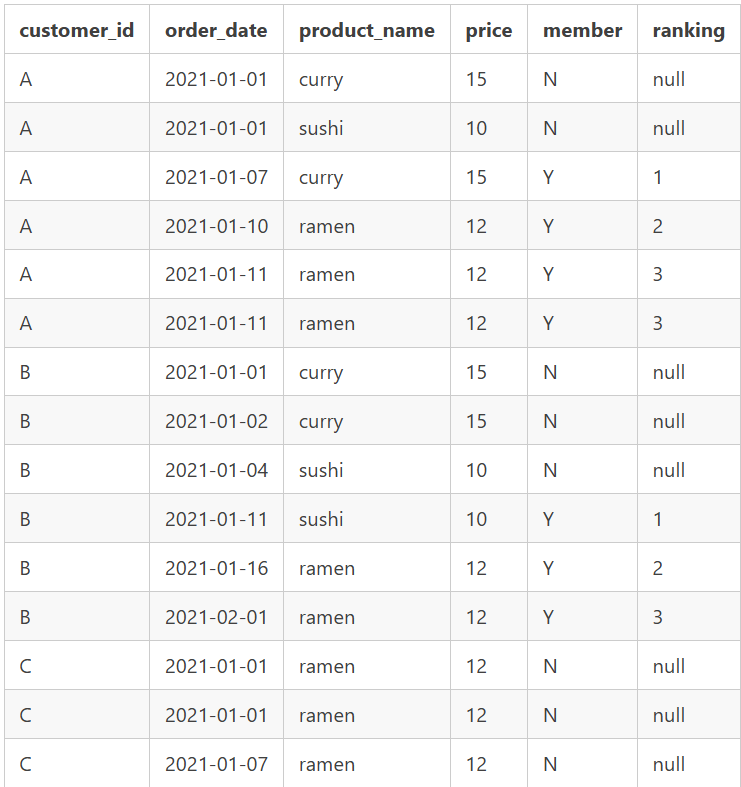

## Case Study #1 - Danny's Diner 

### Introducción 🍣

En 2021, Danny abrió un pequeño pero prometedor restaurante llamado Danny's Diner, especializado en una variedad de platos como sushi, curry y ramen. 

### Objetivo 🎯

El objetivo principal de este análisis es ayudar a Danny a comprender mejor el comportamiento de sus clientes en los primeros meses de funcionamiento del restaurante. A través de este estudio, Danny podrá responder preguntas clave sobre el perfil de sus clientes, sus preferencias, y cómo mejorar la experiencia en Danny's Diner. 

### Preguntas a resolver 🧐

1. ¿Cuál es el importe total que ha gastado cada cliente en el restaurante?
2. ¿Cuántos días ha visitado el restaurante cada cliente?
3. ¿Cuál fue el primer artículo del menú que compró cada cliente?
4. ¿Cuál es el artículo más comprado del menú y cuántas veces lo han comprado todos los clientes?
5. ¿Qué artículo fue el más popular para cada cliente?
6. ¿Qué producto compró primero el cliente después de hacerse socio?
7. ¿Qué artículo compró el cliente justo antes de hacerse socio?
8. ¿Cuál es el total de artículos y el importe gastado por cada cliente antes de hacerse socio?
9. Si cada dólar gastado equivale a 10 puntos y el sushi tiene un multiplicador de puntos por 2, ¿cuántos puntos tendría cada cliente?
10. En la primera semana después de que un cliente se adhiera al programa (incluida su fecha de adhesión) gana 2 veces puntos en todos los artículos, no sólo en el sushi: ¿cuántos puntos tienen los clientes A y B a finales de enero?

#### Preguntas BONUS
1. *Join All The Things*. Recrea la siguiente tabla:

2. *Rank All The Things*. Recrea la siguiente tabla:
